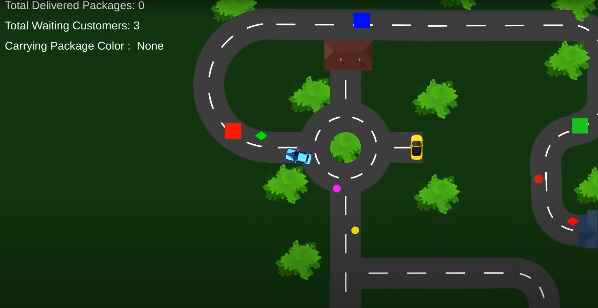
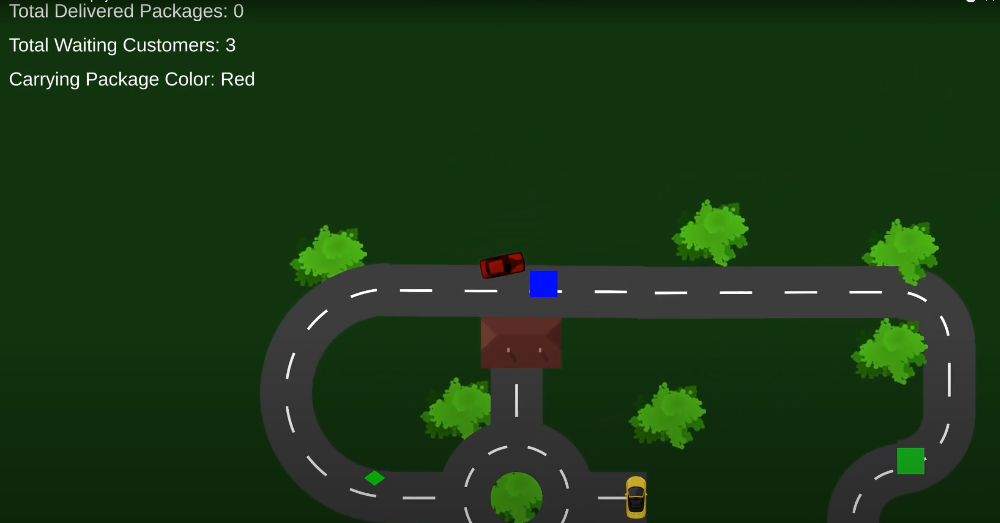
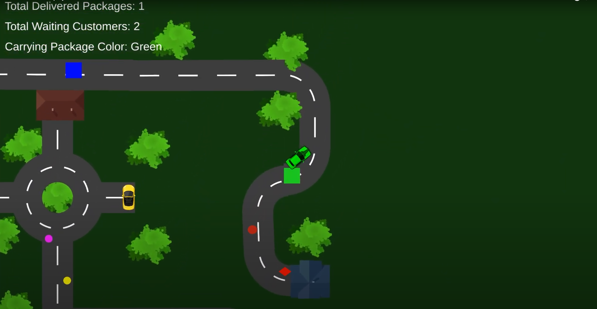
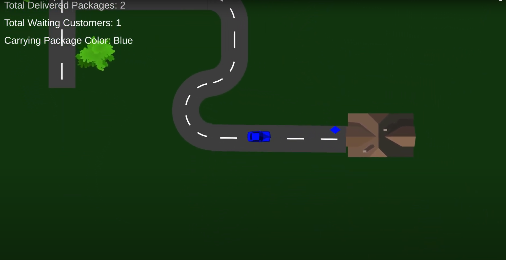
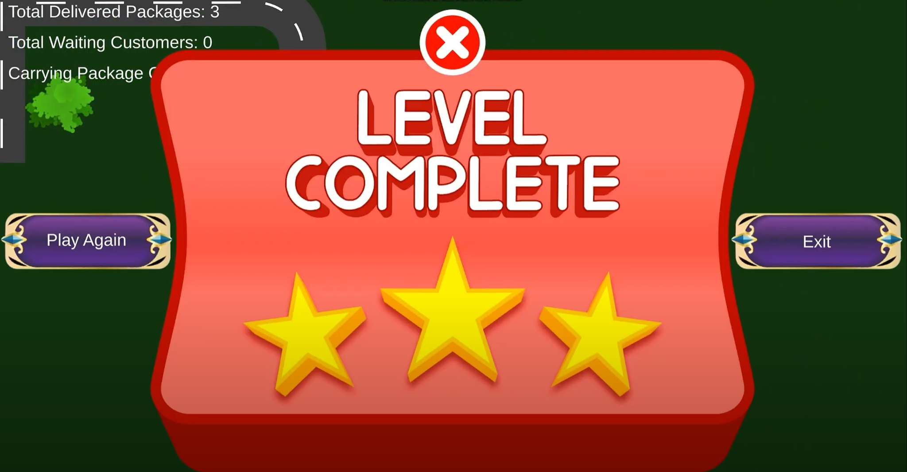

# 🤖 RoboCarGo – Robot Cargo Delivery Game

**RoboCarGo** is a vibrant and engaging delivery puzzle game built with **Unity**, where you take control of an adorable robot car with one job — deliver the right package to the right customer based on color!

---

## 🚗 Gameplay Overview

In RoboCarGo, the rules are simple — but mastering them takes speed and precision:

- 🎨 **Pick up a package**: Your robot car instantly changes its color to match the cargo.
- 🧍 **Find the matching customer**: Deliver the package to the customer with the same color as your car.
- 🔄 **Reset**: After a successful delivery, your car returns to its original **blue** color.
- 🚫 **One at a time**: You can only carry **one package** at a time — no multitasking!

---

## 📦 Package & Delivery System

- The **current cargo color** is always displayed clearly while you're carrying a package.
- After each successful delivery, the game shows how many packages are left.
- Use visual cues and smart movement to plan the fastest route!

---

## 🏁 Victory Condition

Complete all deliveries correctly to **win the game**!

Once all packages are delivered to the correct customers, a **Victory Screen** appears to celebrate your successful job.

---

## 🖼️ Screenshots

### 🎮 Color-Matching Gameplay

### 🚗 Package Pick-Up & Delivery

### 🚗 Package Pick-Up & Delivery

### 🚗 Package Pick-Up & Delivery

### 🏆 Victory Screen

---

## 🎮 Built With

- 🧩 **Unity Engine**
- 🎨 Custom materials & color-coded gameplay
- 🧠 Puzzle design & visual feedback
- 📊 UI updates for live package tracking
- 🔊 Sound effects & animation feedback

---

## 🎥 Gameplay Video

---

## 📬 Contact

Developed by [Muhammed Alperen Karaçete]  
For feedback, collaborations, or questions: [m.alperenk@gmail.com]
